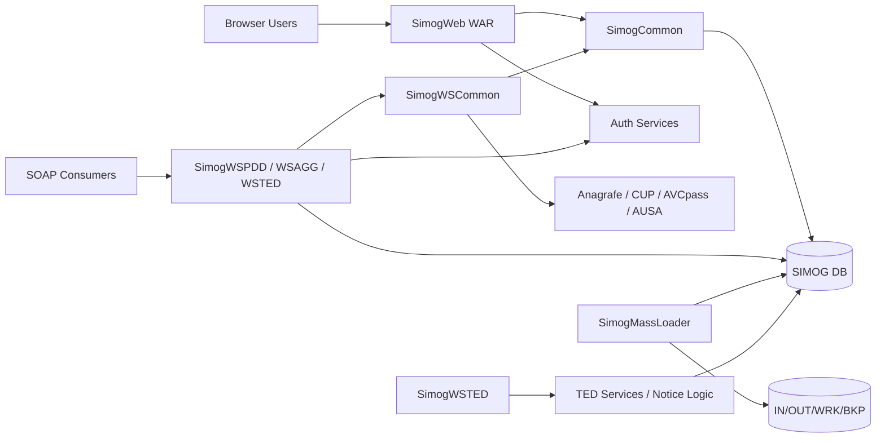
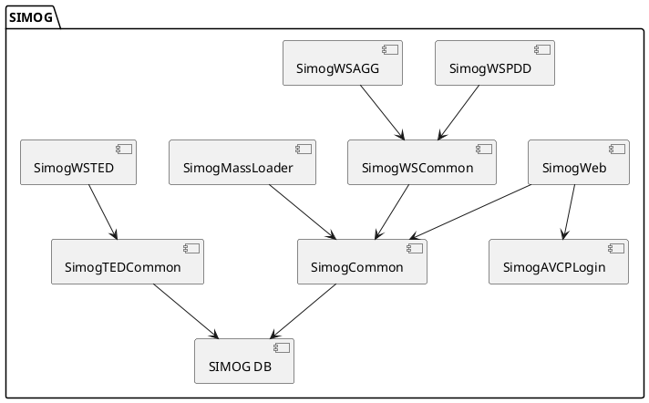
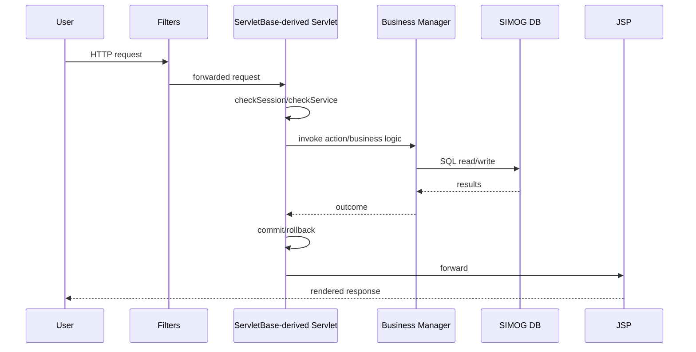
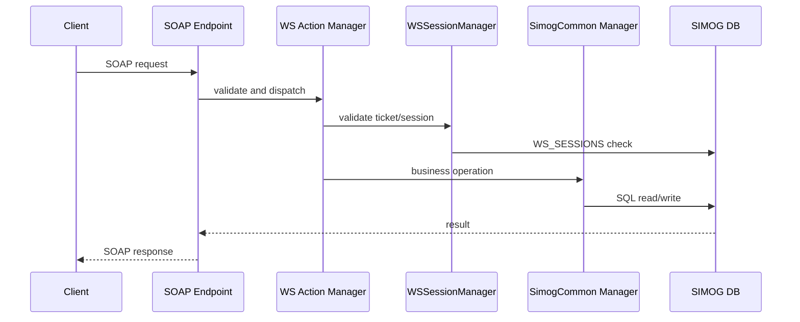
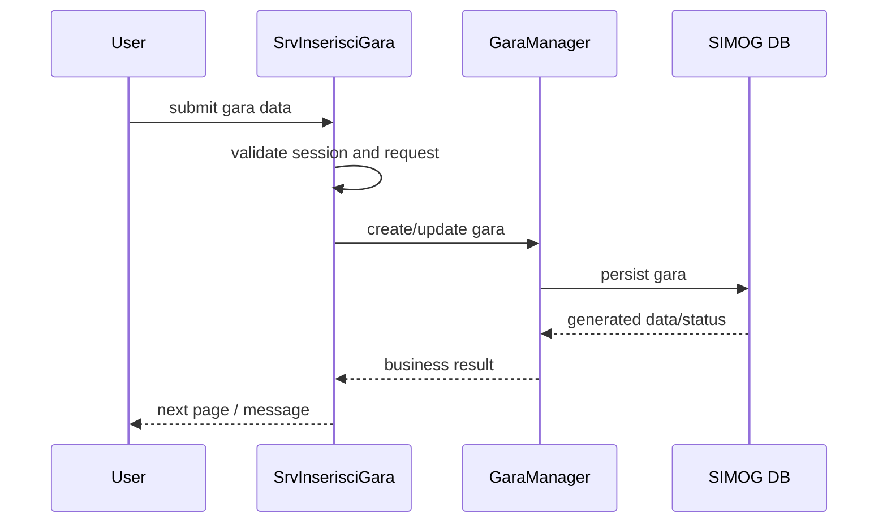
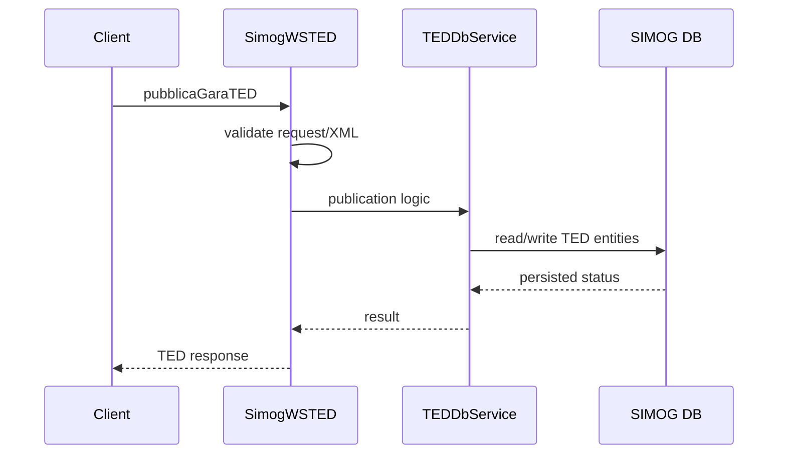

# Diagram Specifications

## 1. System Context Diagram

### Purpose

Show SIMOG in relation to users, external systems, database, filesystem batch exchange, and TED-related interactions.

### Main Elements

- Browser users
- External SOAP consumers
- SIMOG Web (`SimogWeb`)
- SIMOG SOAP Services (`SimogWSPDD`, `SimogWSAGG`, `SimogWSTED`)
- Shared core (`SimogCommon`, `SimogWSCommon`)
- SIMOG database
- Authentication services
- Registry/CUP/AVCPASS/AUSA services
- Batch file exchange directories

### Mermaid

## 2. Container / Component Diagram

### Purpose

Show internal deployable units and their main dependencies.

### Main Elements

- `SimogWeb`
- `SimogWSPDD`
- `SimogWSAGG`
- `SimogWSTED`
- `SimogCommon`
- `SimogWSCommon`
- `SimogAVCPLogin`
- `SimogTEDCommon`
- `SimogMassLoader`

### PlantUML

## 3. Module Dependency Diagram

### Purpose

Highlight central dependency hubs and module direction.

### Key Message

- `SimogCommon` is the dominant core dependency
- `SimogWSCommon` is the SOAP-side orchestration hub
- `SimogTEDCommon` forms a semi-bounded TED subsystem

## 4. Request Lifecycle Sequence Diagram

### Web Request Variant

### SOAP Request Variant

## 5. Business Workflow Sequence Diagrams

### Gara Registration

### TED Publication

## 6. Integration Diagram

### Purpose

Show inbound and outbound integrations grouped by function:

- authentication
- registries
- CUP
- AVCpass
- AUSA
- TED
- database
- filesystem batch

## 7. Deployment Diagram

### Main Nodes

- browser client
- external SOAP clients
- JBoss-like application server hosting multiple WARs
- shared database server
- external authentication and registry endpoints
- batch execution host or scheduled OS job host
- shared filesystem paths for mass-loader

## 8. Domain Model Diagram

### Main Concepts

- Gara
- Lotto
- Pubblicazione
- Iniziativa
- Utente
- WSSession
- TEDNotice
- TedDelta

### Suggested Relationships

- `Gara` 1..* `Lotto`
- `Gara` 0..* `Pubblicazione`
- `Lotto` 0..* `Pubblicazione`
- `WSSession` authorizes service operations on `Gara` and `Lotto`
- `Gara` and `Lotto` feed `TedDelta`
- `TedDelta` contributes to `TEDNotice`
